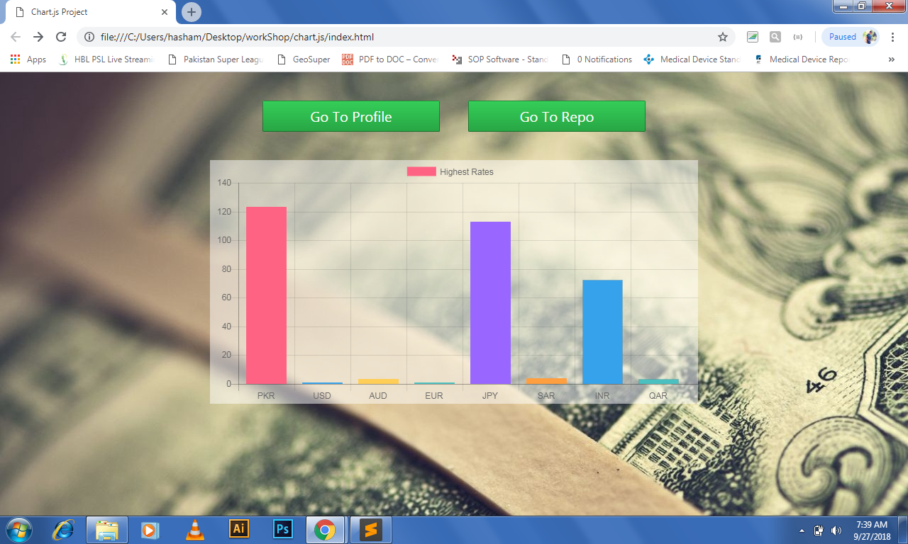

# currencyRate
In This I've Worked With **Chart.js** With **Json's CDN**.
There Are Following Type Of **Codes** Used In This App
1. **HTML**
2. **CSS**
3. **JAVA SCRIPT**

# [Master View | Web Version](https://iffyyy396.github.io/currencyRate/)

# Preview

